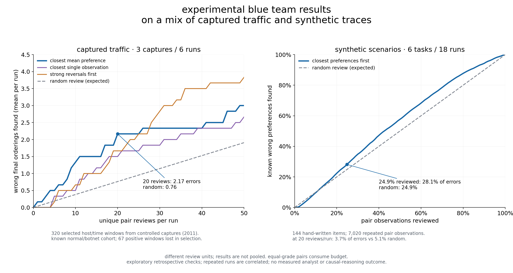

# experimental: are close calls worth reviewing?

a small experiment to see whether close jev decisions tell us where to take a second look.
it retains pair probabilities, builds review queues without labels, and scores those
queues against separate labels at the same review budget.



the captured-traffic check finds **2.17 wrong final orderings in 20 pair reviews per
run**, versus **0.76 expected at random**. the synthetic check is mixed: closest-first
finds **28.1% of known preference errors** at a roughly quarter-sized budget, versus
**24.9%** at random, but does worse at 20 reviews per run (**3.7% versus 5.1%**).
these are different review units and error definitions; the panels are not pooled.

## replay without a key

from the repository root, using python 3.10 or newer:

```sh
python3 examples/closecalls/network_review.py --output /tmp/network-review.json
python3 examples/closecalls/verify_data.py
python3 examples/closecalls/analyze.py \
  --captures examples/closecalls/data/captures.jsonl.gz \
  --labels examples/closecalls/data/labels.json \
  --output /tmp/synthetic-review.json
```

use new output paths. these standard-library scripts verify and replay recorded
results; they make no model calls. regenerate the figure with matplotlib:

```sh
uv run --no-project --with matplotlib python examples/closecalls/plot_overview.py \
  --network /tmp/network-review.json --synthetic /tmp/synthetic-review.json \
  --output /tmp/closecalls-overview.png
```

the bundles retain candidate text, source identities, batch context, full recorded
requests/responses, final network rankings and separate labels. verifiers check
hashes and match preferences back to response matrices, including orientation and
token counts. the full traffic source files remain external, with hashes and
representative byte references; this is not a copy of the complete raw corpus.

## data and review budgets

**captured traffic:** 320 host/time windows from three controlled malware captures
from august 2011, with publisher normal/botnet labels. all six ordinal runs are
included: two seeds per capture, 498 requests and 13,062 pair observations. one
review inspects one unique observed candidate pair within a run. closest-first uses
its mean preference across recorded batch contexts; a scored error means its final
relative order contradicts unequal publisher grades. other queues use the closest
individual observation or strong reversals. random review is an expectation over
the same observed pairs. stable identity hashes break queue ties.

the cohort excludes unknown/background flows before aggregation. subsequent window
selection keeps 320 of 448 windows and loses **67 of 163 positive windows** and four
host/behavior groups before ranking. [source details and attribution](network/README.md)
explain this restricted cohort and the retained provenance.

**synthetic traces:** 144 hand-authored code, configuration and telemetry items in
six tasks, with original fixture relevance grades. all 18 ordinal runs are included:
three seeds, 324 requests and 7,020 repeated pair observations. here, one review
inspects one observation; an error is a decisive preference contradicting unequal
grades. equal-margin ties are averaged over random tie breaks. the quarter budget
is 97 of 390 observations per run. historical `heldout` names do not indicate a
fresh holdout; these cases had already been used.

both queues charge for equal-grade pairs, exact ties and unjudged pairs. labels are
used only to score the selected reviews. related windows, repeated pairs and seeds
are correlated. these checks do not establish calibrated confidence, equal reading
time, useful incidents recovered, or improved causal reasoning. the next question
is whether the signal survives unseen scenarios and independent investigation
judgments, and helps recover evidence buried in the ranked list.

## collect a new small batch

the go example reads only a criterion and candidate ids/text. its default is a dry run:

```sh
go run ./examples/closecalls -input examples/closecalls/data/input.json
```

with `TYPESAFE_API_KEY` already set, explicitly opt into paid requests:

```sh
go run ./examples/closecalls -input examples/closecalls/data/input.json \
  -output /tmp/closecalls-new.jsonl -live
python3 examples/closecalls/analyze.py \
  --captures /tmp/closecalls-new.jsonl \
  --labels examples/closecalls/data/example-labels.json \
  --output /tmp/closecalls-new-results.json
```

defaults are jev-1.13.0 and three shuffled calls, seeds 1/2/3. request timeouts bound
retries. errors remain in the capture and cause a nonzero exit; output files are
owner-readable/writable and never overwritten. this fixed-batch collector is not
the full recursive engine that produced the bundled historical runs.

the library exposes already-computed probabilities through
`CompletionOptions.PairwiseComparisons`; ranking behavior and method signatures
are unchanged. the new slice means `CompletionOptions` is no longer comparable
with `==` or usable as a map key. the main ranking cli does not log comparisons.

## inspect a retained run

[export a run for the ranking review bench](bench-format.md). the export preserves
native scores, exposure, rounds and source positions, with comparison receipts
alongside them. the bench's importer accepted the 64-record example. pair receipts
are not trial snapshots and are not yet displayed there; provider execution remains
unconnected. the importer/exporter check was programmatic, not a browser test.

## checks

```sh
env -u OPENAI_API_KEY -u TYPESAFE_API_KEY go test -race ./...
python3 -m unittest discover -s examples/closecalls -p 'test_*.py'
```
